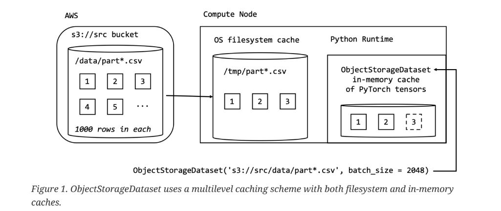

Quick Start: Introduction
============================

.. raw:: html

    

.. role:: red

.. contents::

The :red:`ObjectStorageDataset` provides support for tensor-based, out-of-memory datasets for the
iterable-style interface. The :red:`ObjectStorageDataset` class provides a standard PyTorch interface to datasets stored in the CSV
format, regardless of whether they are located in public cloud object storage or on your local file
system.

The :red:`ObjectStorageDataset` is not available by default when you install
PyTorch, so you need to install it separately in your Python environment using:

.. testcode::

    pip install osds

and once installed, import the class in your runtime using:

.. testcode::

    from osds.utils import ObjectStorageDataset

The :red:`ObjectStorageDataset` class provides a standard PyTorch interface to datasets stored in the CSV
format, regardless of whether they are located in public cloud object storage or on your local file
system. For every call to the :red:`__iter__` method of the class, the result is a PyTorch tensor of the
numeric values from the CSV based dataset.

The tensor returned by :red:`ObjectStorageDataset` must be separated into the label and the features needed to perform an
iteration of gradient descent.For example:

.. testcode::

     object_name = ObjectStorageDataset('./path/')

     batch = next(iter(DataLoader(object_name)))
     labels, features = batch[:, 0], batch[:, 1:]

Intiate URL File Path
-----------------------

To instantiate the ObjectStorageDataset, you must specify a URL-style path (similar to a Unix glob
string) pointing to the location of your CSV-formatted dataset. 

Please review the following table for more details. 

============================== ==================================================
	path-url            			Description
============================== ==================================================
	**file://**   		Files residing on the local file system
        **f"s3://** 	    	Amazon-S3   
	**abfs://** 	    	Azure Blob storage
        **f"gcs://** 	   	Google Cloud Storage
============================== ==================================================

For example, the path url of the file residing on the local storage system intiate from **file://**. If you have configured the **BUCKET_ID** and **AWS_DEFAULT_REGION** environment variables for the S3 bucket containing your
cleaned up dataset, you can instantiate the class using:

.. testcode::

     BUCKET_ID = os.environ['BUCKET_ID']
     AWS_DEFAULT_REGION = os.environ['AWS_DEFAULT_REGION']

     BATCH_SIZE = 1_048_576 // = 2 ** 20
     train_ds = ObjectStorageDataset(f"s3://dc-taxi-{BUCKET_ID}-{AWS_DEFAULT_REGION}/csv_vacuum/part*.csv", batch_size=BATCH_SIZE)

where the train_ds gets assigned an instance of the :red:`ObjectStorageDataset`. Since the
:red:`ObjectStorageDataset` supports the wildcard character (*), the Python f-string used to create the
train_ds instance must specify that the dataset should include all of the objects in S3 matching the
:red:`/csv_vacuum/part*.csv` path in the :red:`dc-taxi-${BUCKET_ID}-${AWS_DEFAULT_REGION}` S3 bucket.

Batch Size
-------------

The :red:`batch_size` parameter used in the example is required when using :red:`ObjectStorageDataset` with
out-of-memory datasets. By default, the :red:`ObjectStorageDataset` is designed to instantiate in the
shortest amount of time possible in order to start the iterations of gradient descent. In practice, this
translates to :red:`ObjectStorageDataset` caching in-memory and on disk just the dataset objects (typically
from object storage) needed to return the just the first batch of examples from the dataset, as
illustrated here:

In the example on figure 1.1, :red:`ObjectStorageDataset` is instantiated using a fictional src S3 bucket
containing CSV-formatted objects with a complete URL-style path as s3://src/data/part*.csv. The
partitions of the dataset (i.e. the CSV formatted objects with the names matching part*.csv) reside
under the data folder in the src bucket. Note that the size (number of rows) of the partitions is
entirely independent of the batch_size used to instantiate :red:`ObjectStorageDataset`, meaning that the
:red:`batch_size` can vary while the size of the partitions stays constant.

In general, the number and the size of the dataset partitions
varies depending on the specifics of the machine learning project, although it is better to choose the
size of the partitions to be in the range of 100-200MB for efficient transfer over a network
connection if you are working with commonly deployed 100Mbps network interfaces.

Eager Load Batches
-------------------

Although the default, one batch at a time, loading behavior of the :red:`ObjectStorageDataset`class is

useful for reducing the time spent during the instantiation of the class, it can be convenient to pre-
download the entire dataset to the local filesystem cache before starting to process it. To control the 
default behavior, you can use the eager_load_batches named parameter when instantiating the
:red:`ObjectStorageDataset`. For example when using:

.. testcode::

	train_ds = ObjectStorageDataset(f"s3://dc-taxi-${BUCKET_ID}-${AWS_DEFAULT_REGION}/test/part*.csv", eager_load_batches=True)

All of the dataset partitions located in the S3 bucket are downloaded to the filesystem cache before
the __init__ method of the ObjectStorageDataset returns.

Data Type
-------------

By default, :red:`ObjectStorageDataset` uses the widest available PyTorch data type to store the data in-
memory. Although this approach serves to avoid loss in number precision when converting data

from CSV format to in-memory cache, it is memory-consuming. For example, if you attempt to fetch
a batch of data using the default settings:

.. testcode::

	train_ds = ObjectStorageDataset(f"s3://dc-taxi-${BUCKET_ID}-${AWS_DEFAULT_REGION}/test/part*.csv", batch_size=BATCH_SIZE)

	batch = next(iter(DataLoader(train_ds)))
	assert batch.dtype == pt.float64

the assertion succeeds on 64 bit CPUs since pt.float64 is the widest available PyTorch data type for
this CPU architecture. Similarly, any integer values in the CSV dataset are loaded as pt.int64 by
default.

To override the default loading behavior and reduce the amount of memory used per batch of data,
you can specify the PyTorch data type for :red:`ObjectStorageDataset` to use on column by column basis
as shown here:

.. testcode::

	train_ds = ObjectStorageDataset(f"s3://dc-taxi-{BUCKET_ID}-{AWS_DEFAULT_REGION}/csv_vacuum/part*.csv",
					batch_size=BATCH_SIZE,
					dtype={'fareamount': 'float16',
					'origin_block_latitude': 'float16',
					'origin_block_longitude':'float16',
					'destination_block_latitude':'float16',
					'destination_block_longitude':'float16'})

In the cases where all the columns in the dataset use a common dtype, you can use a Python str
instead of the dict from the previous example, simplifying this to:

.. testcode::

	train_ds = ObjectStorageDataset(f"s3://dc-taxi-{BUCKET_ID}-{AWS_DEFAULT_REGION}/csv_vacuum/part*.csv", batch_size=BATCH_SIZE, dtype='float16')